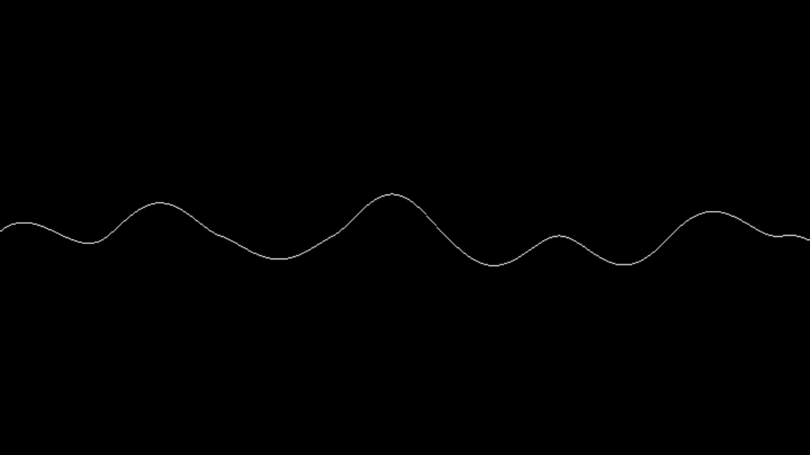

# perlin noise experimentations
This is a simple project to experiment with perlin noise. The project is written in c++ using X11 for the windowing system.
There are 7 different way to generate images using perlin noise built-in the project:

 - cloud effects using 2 superposed perlin noise
 - 2 graph representation of perlin noise in 2D
 - marble effect
 - wood effect
 - one effect that I don't know how to describe
 - procedural landscape

 ## usage:
```bash
# clone:
git clone https://github.com/lohhiiccc/Noise-generator
# compile:
make
# run:
./perlin
```

## how to use it:
- press space bar to change the effect
- press escape to quit the program
## dependencies:
 - X11
 - g++
 - make

## how it works:
The project is divided in 3 main parts:
 - the noise generation
   - cache pseudo-random gradient vectors based on seed
   - cut the image in a grid of cells
   - for each cell, generate a pseudo-random gradient vector
   - for each pixel in the cell, calculate the distance to the 4 corners of the cell and interpolate the gradient vectors
 - the image generation
   - image are basically 2D array of uint32_t
 - the x11 windowing system
   - open a connection to the X server
   - get a default root window
   - define window properties
   - create the main window
   - event handling
     - key press event
       - quit the program with escape key
       - change the effect with space bar
     - close window event
   

## How to add effects:
- create effect function in effects folder
- follow the same pointer function signature as the other effects ```int (*name)(uint32_t *image, bool &needUpdate)```
- add the effect in the ```main.cpp``` file by adding the function pointer in the vector of function pointers ```window.load_render(<new_effect_name>);```
- make again the project !

## some visual examples:
### cloud effect:


### graph representation:


## second graph representation:


### marble effect:


### wood effect:


### procedural landscape:


### unknown effect:


## real usage of perlin noise:
- perlin noise is a random noise that is coherent, meaning that the noise is smooth and continuous
- this property makes perlin noise very useful in procedural generation
- in computer graphics and video games, perlin noise is used to generate textures, terrain, clouds, particles, etc...
- the advantage of perlin noise is that you can reduce the weight of your assets by generating them on the fly

# author:
 - @lohhiiccc

this is my first project with X11, i may have done some things wrong, feel free to tell me how to improve it.